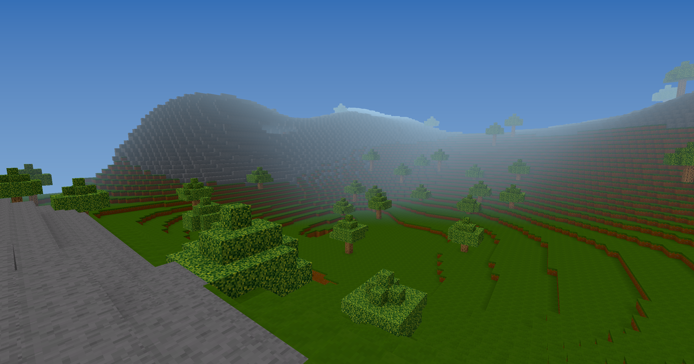

# GaiaLegacy



> **Build a world you must inhabit.**

GaiaLegacy is an experimental physical voxel survival project focused on embodied choices, deterministic exploration, and systems that meet at clear technical boundaries.

The public repository is currently a **pre-alpha Milestone 1 foundation**, not a finished game. The source build offers a finite generated world to explore with fixed-step movement, a modernized voxel render pipeline, a transactional three-slot body inventory, and an early logical breaking/placement loop. Interaction feedback, physical world items, persistence, and the broader survival loop remain under development.

## Current public build

| Area | Status |
| --- | --- |
| Deterministic 81-Chunk world | **Available** |
| Plains, hills, rocky highlands, trees, entrances, connected caves | **Available** |
| Fixed 1/60-second player physics, collision, stepping, ground snap, noclip | **Available** |
| GLSL 410 lighting, AO, sky, fog, frustum culling, render metrics | **Available** |
| Data-driven block/material/atlas resources | **Available** |
| Transactional left-hand, right-hand, and mouth inventory | **Available (developer-facing)** |
| Survival/Creative breaking and placement; logical world-item storage | **Available (no visual feedback yet)** |
| Crack/world-item visuals, HUD, pickup, saves, broader survival | **Planned / not playable** |

Phase 9A candidate baseline: [`main@078067e`](https://github.com/TyrantProductions-svg/GaiaLegacy/commit/078067e), checked 2026-07-27. The Phase 9A implementation is currently local to `feat/block-interaction-core` until review and merge.

## Build and run

Requirements:

- Git
- JDK 21 recommended for running Gradle
- Java 17 source/target compatibility
- OpenGL 4.1-capable desktop graphics

Windows:

```powershell
.\gradlew.bat clean test build --console=plain --no-daemon
.\gradlew.bat :game --console=plain --no-daemon
```

macOS:

```bash
./gradlew clean test build --console=plain --no-daemon
./gradlew :game --console=plain --no-daemon
```

The current Phase 9A candidate passes 994 automated tests. Latest native macOS/Retina acceptance is **NOT RUN**; the OpenGL and build architecture intentionally target macOS compatibility, but this is not a substitute for native evidence.

## Controls

| Action | Binding |
| --- | --- |
| Move | `W A S D` |
| Look | Mouse |
| Jump | `Space` |
| Toggle noclip | Double-tap `Space` |
| Descend in noclip | `Left Shift` |
| Break targeted block | Hold left mouse button |
| Place selected block | Right mouse button |
| Select left hand / right hand / mouth | `1` / `2` / `3` or mouse wheel |
| Drop active item logically | `Q` |
| Toggle Survival / Creative | `F4` |
| Release/recapture cursor | `F1` |
| Exit | `Escape` |

Phase 9A does not yet draw the selected slots, crack progress, or dropped items. A successful logical drop therefore has no world-space visual until later phases.

## Project map

- [Wiki home](https://github.com/TyrantProductions-svg/GaiaLegacy/wiki)
- [Current status](https://github.com/TyrantProductions-svg/GaiaLegacy/wiki/Current-Status)
- [Getting started](https://github.com/TyrantProductions-svg/GaiaLegacy/wiki/Getting-Started)
- [Architecture overview](https://github.com/TyrantProductions-svg/GaiaLegacy/wiki/Architecture-Overview)
- [Roadmap](https://github.com/TyrantProductions-svg/GaiaLegacy/wiki/Roadmap)
- [Contributing and testing](https://github.com/TyrantProductions-svg/GaiaLegacy/wiki/Contributing-and-Testing)

The Wiki is the detailed source for project state, player guidance, architecture, limitations, provenance, and future direction.

## Repository boundaries

- `engine/`: reusable runtime, rendering, physics, input, events, scheduling, ECS primitives, resources, voxel storage and meshing
- `game/`: Gaia startup composition, resources, world generation, and future gameplay integration
- `docs/`: architecture decisions, plans, references, and phase handoffs

OpenGL/GLFW and GPU lifecycle operations stay on the context-owning main thread. CPU world generation and meshing may run on workers and publish results through explicit revisioned boundaries.

## License and provenance

GaiaLegacy currently has **no published project-level reuse license**. The repository's third-party dependencies retain their own licenses, documented in [THIRD_PARTY_NOTICES.md](THIRD_PARTY_NOTICES.md), but those licenses do not grant permission to reuse GaiaLegacy's own code, documentation, screenshots, or original artwork.

No Terasology, Create, Minecraft, or other third-party project code or art is copied into GaiaLegacy. See [docs/references.md](docs/references.md) for the provenance statement.
