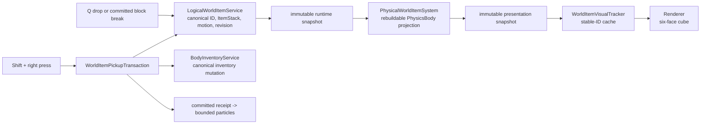
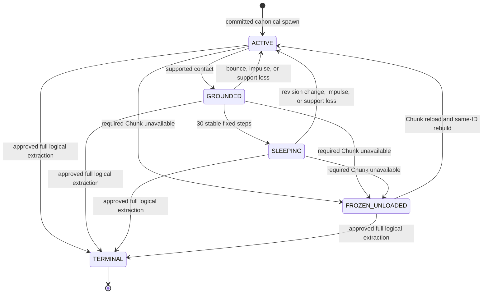
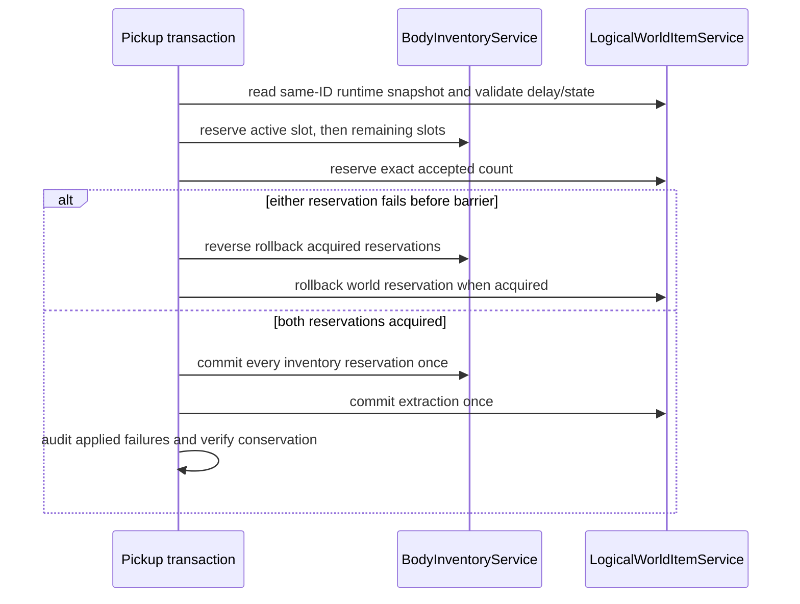

# Phase 11 Handoff: Physical World Items

Date: 2026-08-07

Branch: `feat/physical-world-items`

Baseline and current HEAD:
`819a690f85ab4b1a192bd2db3bca73ddb573ced7`

Status: **PHASE 11 IMPLEMENTATION AND WINDOWS DEVELOPMENT ACCEPTANCE PASS;
NATIVE macOS ACCEPTANCE NOT RUN**

Nothing is staged, committed, pushed, merged, or placed in a pull request.

## Completed work

- Added the canonical physical runtime snapshot and revision-checked motion
  boundary to the unique `LogicalWorldItemService`.
- Added closed maximum-revision extraction behavior, read-only inventory/world
  reservation audits, and typed world commit failure identity.
- Added one stable-ID physical projection with unified deterministic admission,
  transactional rollback, exact lifecycle metrics, fixed 1/60 physics, static
  voxel collision, restitution, supported friction, sleep/wake, overlap
  recovery, finite-world fail-closed handling, and unloaded-Chunk freezing.
- Added deterministic independent item targeting and stateless Shift+right
  routing in Survival outside noclip.
- Added active-slot-first multi-slot reservation planning and the synchronous
  inventory-first/world-second pickup conservation barrier. Full pickup removes
  one canonical ID; partial pickup retains the same ID.
- Added explicit GameContext/bootstrap/fixed-step ownership without expanding
  `ServiceLocator`.
- Added six-face 0.50-cube presentation, physical interpolation, committed-only
  pickup particles, priority-safe particle caps, immutable allocation metrics,
  and deterministic headless profiling.
- Added idempotent runtime cleanup that stops new pickup work, removes bodies,
  clears presentation/particle caches, and never deletes canonical items.
- Added focused RED/GREEN and integrated regressions across engine, game, and
  tools.
- Corrected Phase 11.6 gameplay feel and production drop wiring:
  - plain Q extracts exactly one item, while left or right Ctrl+Q extracts the
    complete active-slot stack without held/catch-up replay;
  - successful Survival break always commits a canonical count-one world drop,
    even when inventory has capacity;
  - Q and block drops use copied deterministic launch transforms and the same
    unique future-spawn reservation authority;
  - block drops use a `1.25..1.75 blocks/s` base/outward horizontal magnitude
    plus a separate orthogonal `+/-0.20 blocks/s` lateral component; their total
    horizontal resultant cannot exceed approximately `1.7614 blocks/s`;
  - one post-commit feedback coordinator owns held-item animation, copied-view
    analytic camera impulse, bounded voxel proxies, and exact particle
    requests;
  - mixed golden-angle debris, astral, placement, and inward pickup particles
    retain the existing single priority-safe 512-particle system.
- Added presentation-only first-person movement feel: a fixed-step 1.8 Hz walk
  bob with `0.025` vertical, `0.012` lateral, and `0.18` degree roll maxima;
  grounded-to-grounded step smoothing; jump takeoff; and impact-scaled landing.
  Immutable previous/current presentation snapshots are interpolated at render
  alpha, movement presentation composes before action impulse, and canonical
  Camera/raycast authority remains unchanged.
- Corrected the first-person held-block viewmodel without changing cube
  geometry, UVs, world rendering, or gameplay. The pass now clears only depth,
  enables depth testing/writes and canonical back-face culling for the held
  cube, then restores the prior GL state.
- Closed the live exclusion-mask uniform-array path so repeated break/place
  rendering no longer raises `uniform was not required`.

Canonical world-item automatic expiry is deferred. Phase 11 defines physical projection, pickup, unloaded-Chunk freezing and runtime cleanup, but does not define despawn duration or timeout-based stable-ID termination.

## Deferred and unfinished work

- Windows development acceptance is **PASS** for the Phase 11 behaviors listed
  in the acceptance matrix below.
- Installed-distribution interactive acceptance is **NOT RUN**; `installDist`
  itself passed during the build.
- Native macOS/Apple Silicon/Retina/OpenGL 4.1 acceptance is **NOT RUN**.
- Profiling exceeds allocation/collection review thresholds; a separate
  approved attribution task is required before considering bounded internal
  reuse. Phase 11 intentionally adds no pooling.
- Staging, commit, push, pull request, and merge remain unauthorized.

## Core architecture decisions

- `LogicalWorldItemService` is the only canonical world-item authority.
- `BodyInventoryService` is the only inventory mutation authority.
- One stable ID owns at most one logical item, one registered physical body,
  and one reconstructable visual entry.
- Capacity pressure, missing chunks, sleep, bounded recovery failure, and
  shutdown never remove or decrement a canonical item.
- Pickup input is one Shift+right press edge; it cannot fall through to block
  placement and cannot replay in held-only catch-up steps.
- Plain Q drops one; either Ctrl+Q drops the complete active-slot stack. The Q
  edge is lifecycle-gated and commits one world spawn paired with one exact
  inventory extraction.
- Survival break loot is a canonical world item, never an opportunistic direct
  inventory insertion. Creative break produces no drop.
- Pickup reserves inventory capacity before the exact world count and enters a
  non-cancellable commit barrier. Applied failures are never retried or
  compensated.
- LOW particles cannot evict HIGH committed feedback. HIGH evicts oldest LOW
  first, then oldest HIGH.
- Gameplay feedback consumes committed facts only. Camera impulse changes only
  a copied render view; transient block proxies are presentation-only, capped
  at 256, and never delay World/collision mutation or change Chunk revision.
- First-person movement is a presentation-only layer evaluated at fixed 1/60
  and interpolated at render alpha. Walk bob and grounded traversal/jump/land
  responses compose before the independent action impulse and never alter the
  authoritative Camera, player body, collision, or raycast.
- The held-item viewmodel is a camera-space rigid cube. Its pass preserves
  canonical outward CCW geometry and six-face UV mapping, clears only the depth
  attachment after world rendering, uses depth testing/writes plus canonical
  back-face culling, and restores the incoming GL state afterward.
- Renderer and UI consume immutable presentation only. OpenGL ownership stays
  on the main context thread and GLSL remains 410.

## Authority and presentation flow



No physical, visual, particle, renderer, or UI type owns a second `ItemStack`
store or canonical lifecycle. Q-drop and block break both enter the unique
world-item spawn/reservation backend; neither directly constructs a body or
visual. Survival block break preserves the existing canonical whole-block loot
calculation (normally count one). Creative, air, unbreakable blocks, and blocks
without a canonical item form create no invented drop.

## Projection lifecycle



`TERMINAL` is a logical absence, not an independently owned physical state.
There is no lifetime clock or timeout transition. Unload preserves ID, stack,
count, and motion revision while stopping gravity/integration. Reload restores
exactly one projection. Bounded overlap/world-bound recovery never wraps,
changes count, or invents an ID; failure retains the canonical item and
fail-closes physical progression. Shutdown removes runtime projections and
presentation resources only and does not terminally remove canonical items.

## Physics and capacity constants

| Property | Production value |
|---|---:|
| Fixed step | `1/60 s` |
| Logical/projection hard cap | `1,024` |
| Visual and collider edge | `0.50 block` |
| Centered local collider | `[-0.25, +0.25]` per axis |
| Gravity | `-25 blocks/s^2` |
| Maximum fall speed | `-30 blocks/s` |
| Restitution | `0.12` |
| Supported horizontal friction | `0.25` |
| Ground probe/snap | `0.02 block` |
| Sleep speed threshold | `0.05 blocks/s` |
| Sleep delay | `30` fixed steps (`0.5 s`) |
| Depenetration attempts | `8` |
| Pickup reach | `3.5 blocks` |

The collision proxy and rendered cube use the same `0.50` constant. Rendering
uses all six canonical block face regions; a single flat atlas tile is not
treated as the complete block item.

## Input priority and targeting

| Priority | Condition | Outcome |
|---:|---|---|
| 1 | stopping, loading, unfocused, uncaptured, blocking UI, or F4 transition | no world interaction |
| 2 | Creative or noclip | no pickup |
| 3 | Survival, either Shift, right-button press edge | claim pickup and suppress placement |
| 4 | right-button press edge without Shift | existing block placement |
| 5 | held/replayed right-button state | no new pickup request |

The router accepts left or right Shift through platform-neutral input constants.
It is stateless and consumes only the derived right press edge. A failed pickup
does not fall through to placement, and catch-up steps after the first receive
held-only input.

Targeting starts at authoritative player feet plus eye height, uses the Camera
forward vector, intersects immutable centered `0.50` physical AABBs, and admits
only `ACTIVE`, `GROUNDED`, or `SLEEPING` candidates inside `3.5` blocks. It
selects nearest non-negative distance with stable-ID ascending as the exact tie
break. A separate block raycast supplies an exclusive opaque-block distance;
the canonical block hit is neither reused nor mutated. Delayed, reserved,
frozen, missing, and terminal items are excluded.

## Pickup conservation barrier



The executable result contract enforces:

```text
original world count = inventory committed count + remaining world count
```

Full pickup commits the entire count and makes the one logical stable ID absent.
Partial pickup commits only accepted inventory count and retains the positive
remainder under the same ID, position, velocity, and projection/visual identity.
Pre-barrier failures preserve the original count and release reservations in
reverse order. Applied notification failures are counted as applied, never
retried or compensated; all guaranteed commits still run. Read-only reservation
audit distinguishes committed, pending, and indeterminate provider failures.
The primary failure is preserved and later failures are suppressed. At
`Long.MAX_VALUE`, full extraction follows the terminal path while partial
extraction returns the closed `REVISION_EXHAUSTED` result without changing the
item, revision, pending reservation, or active lock.

The integrated regressions assert exact full and partial counts, same-ID
remainder, exact body identity, full-pickup body/visual removal, partial visual
retention, idempotent commits, rollback, busy/full/delayed/missing outcomes,
and notification/fatal failure conservation.

## Particle bounds and measurement

| Bound | Value | Overflow policy |
|---|---:|---|
| LOW active particles | `384` | reject LOW admission |
| Protected HIGH reserve | `128` | LOW cannot consume or evict it |
| Total active particles | `512` | hard cap |
| Emission requests per fixed step | `64` | deterministic rejection after cap |
| Particles per request | `32` | closed validation rejection |

Committed break, placement, drop, and pickup feedback is HIGH;
ambient/continuous feedback is LOW. HIGH evicts oldest LOW before oldest HIGH.
Break emits 16 textured debris plus 4 lilac astral particles, placement emits
6 debris plus 2 astral particles, and pickup emits 8 inward aqua particles.
Tint is carried through the immutable particle snapshot and GPU vertex path.
Particle lifetime remains deterministic visual cleanup and has no canonical
item identity. The profiler
exercised 1,024 logical items, 512 requested particles, 600 warmup steps, and
3,600 sample steps. It observed 1,024 peak items, 216 peak particles,
3,679,206,752 allocated bytes, 12 collections, 27 ms collection time, and a
3 ms maximum observed pause. Allocation rate was about 58.5 MiB/s. Allocation
and collection thresholds request later attribution; pooling remains disabled.

## Platform status and deferred scope

| Platform | Automated | Interactive development/installDist |
|---|---|---|
| Windows | clean test/build and resource checks passed | Development PASS; installDist NOT RUN |
| macOS Apple Silicon | NOT RUN | NOT RUN |
| Linux CI | NOT RUN in this workspace | NOT RUN |

Automation is not reported as interactive acceptance. Deferred work includes
body-body collision, rotation/angular velocity, pooling, persistence,
networking, moving voxel structures, item merging, complex pickup animation,
and canonical automatic expiry.

## Modified and created files

Documentation:

- `docs/architecture/current-baseline.md`
- `docs/architecture/physical-world-items.md`
- `docs/agent-handoffs/phase-11-progress.md`
- `docs/agent-handoffs/phase-11-handoff.md`
- `docs/testing/phase-11-world-item-acceptance.md`
- approved Phase 11 design and implementation plan under `docs/superpowers/`

Engine production and tests:

- physics configuration/body/world support under `engine/src/main/java/com/overlord/{config,physics}`
- reservation audit and physical runtime contracts under
  `engine/src/main/java/com/overlord/{core/transaction,inventory/api,worlditem}`
- six-face visuals, priority particles, render pass, renderer uniform setup,
  and GLSL 410 resources under `engine/src/main/{java,resources}/com/overlord/renderer`
  and `engine/src/main/resources/assets/overlord/shaders/feedback`
- focused physics, world-item, particle, mesh, shader, and render-pass tests
  under `engine/src/test` plus the logical-world-item test fixture

Game production and tests:

- `GameBootstrap`, `GameContext`, and `GameLoop`
- reusable reservation planning under `game/src/main/java/com/gaia/inventory`
- pickup targeting/routing/transaction/controller and physical projection under
  `game/src/main/java/com/gaia/worlditem`
- six-face resolution, stable-ID tracking, committed pickup particles, and
  cleanup under `game/src/main/java/com/gaia/interaction/feedback`
- the existing block-break transaction migrated to the shared planner
- focused and integrated tests under the corresponding `game/src/test/java/com/gaia`
  packages

Tools:

- `tools/src/main/java/com/gaia/tools/WorldItemPerformanceFixture.java`
- `tools/src/test/java/com/gaia/tools/WorldItemPerformanceFixtureTest.java`
- `tools/build.gradle`

The final working-tree inventory is intentionally tracked/untracked and
unstaged; `git status --short --untracked-files=all` is the authoritative exact
file list. After this documentation closure it contains 163 entries: 67
unstaged tracked modifications and 96 untracked files, with 0 staged entries.
`git diff --stat` covers only the tracked subset; untracked files are
necessarily excluded from Git's unstaged diff statistic.

## Verification

The final Phase 11.6 transaction/API closure uses one production Q-drop path,
proven-only inventory and spawn rollback barriers, exact committed spawn runtime
identity, and a consecutive-frame exclusion-mask regression. Blind independent
retry or allocation of a replacement stable ID is forbidden. Audited completion
of the SAME reservation with the SAME stable ID is allowed and required when
the reservation is proven PENDING and the commit barrier must be completed.

Latest pre-documentation verification command:

```powershell
.\gradlew.bat clean test build --console=plain --no-daemon
```

Result: `BUILD SUCCESSFUL`; all 29 tasks executed.

- Engine: 947 tests, 0 failures, 0 errors, 0 skipped.
- Game: 825 tests, 0 failures, 0 errors, 0 skipped.
- Tools: 27 tests; 26 passed, 1 existing skip, 0 failures/errors.
- Total: 1,799 tests; 1,798 passed, 1 skipped, 0 failures/errors.
- Build-integrated packaged resources, packaged shaders, installed shaders,
  generated UI assets, archives, and `installDist` passed.
- The exact combined pre-final resource rerun passed all four requested checks:
  packaged resources, packaged shaders, installed shaders, and generated UI
  assets (`14` actionable tasks, all executed).

Latest pre-documentation module-level verification also passed independently:

- `:engine:test` - 947 tests.
- `:game:test` - 825 tests.
- `:tools:test` - 27 tests, including the one existing skip.

## Windows development acceptance

Human Windows development acceptance is **PASS**. The accepted live behaviors
are:

- Q single-item drop and Ctrl+Q full-stack drop;
- canonical Survival block drops, no automatic pickup, and Shift+right-click
  manual pickup;
- physical drop behavior;
- break/place transient feedback and mixed debris/astral particles;
- walking bob, natural step-up/down smoothing, and jump/landing presentation;
- correct held-block orientation and a convex solid held cube;
- a stable live exclusion-mask shader/uniform path with no renderer crash.

The held cube had appeared concave because the first-person viewmodel pass had
disabled depth testing, depth writes, and face culling. Back/interior triangles
could therefore overwrite visible faces in draw order. The correction clears
only depth before the viewmodel, enables depth testing/writes and canonical
back-face culling, and restores the prior GL state afterward. Geometry, UVs,
world rendering, and gameplay are unchanged.

The Phase 11.6 independent-review correction resolved all five reported
findings:

- Spawn commit exceptions now carry exact reservation identity and applied
  state. Read-only audit exposes the same reservation as `PENDING`,
  `COMMITTED`, or `ROLLED_BACK`; reconciliation only completes that reservation
  and never allocates another stable ID. Q and block-break retain unresolved
  barriers, block duplicates, and resolve them idempotently during shutdown.
- The copied-view camera uses bounded analytic envelopes. PLACE peaks at
  `+0.35` pitch and `-0.006` Y and BREAK at `+0.55` pitch and deterministic
  `+/-0.14` yaw. Exact zero samples at 10/30/60/144/240 FPS are respectively
  `0.200000/0.166667/0.150000/0.152778/0.150000` seconds for PLACE and
  `0.200000/0.200000/0.200000/0.201389/0.200000` seconds for BREAK.
- First-visible, fixed-catch-up, post-close, held-item draw, transient-proxy,
  old six-face material, exception restore, nonzero exclusion-mask, transition
  expiry, and kinematic edge cases now have behavioral assertions.
- A non-white `0.2/0.4/0.7/0.6` tint is asserted on every uploaded cube vertex;
  the test was mutation-checked against an all-white uploader.
- Fresh JUnit XML totals replace the stale handoff counts.

Phase 11.6 self-review reproduced four defects before their production
corrections:

- RED astral-particle tint regression failed because no tint reached the GPU;
  GREEN carries validated immutable tint through emission, simulation, batch,
  vertex shader, and fragment shader.
- RED close-boundary regression rebuilt world-item visuals after coordinator
  shutdown; GREEN snapshots a closed empty frame and rejects later updates.
- RED render-order regression advanced a new action before its first visible
  frame; GREEN renders the captured start pose before advancing frame time.
- RED transient-cap regression accepted 257 exclusion cells; GREEN rejects any
  capacity outside `1..256` at construction.

Full profiling command:

```powershell
.\gradlew.bat :tools:profileWorldItems --console=plain --no-daemon
```

Result:

```text
worldItems=1024 particles=512 warmupSteps=600 sampleSteps=3600 peakWorldItems=1024 peakParticles=216 allocationSupported=true allocatedBytes=3679206752 gcCollections=12 gcTimeMillis=27 maxGcPauseMillis=3 simulationHash=-6638820482655353883
```

This is about 58.5 MiB/s. Allocation rate and GC count cross the approved
follow-up thresholds; maximum observed pause does not. Pooling remains off.

Repository checks:

- `git diff --check`: exit 0; only line-ending normalization warnings.
- staged file count: 0.
- HEAD/origin divergence: `0 0`.
- generated tracked artifacts: 0.
- engine-to-game dependency hits: 0.
- renderer-to-gameplay-service dependency hits: 0.
- duplicate domain model scan: only canonical `ItemStack` and the single
  bootstrap `LogicalWorldItemService` construction.
- forbidden GL/JDK scan hits were confined to tests that assert rejection and
  historical/planning documentation; production sources were clean.

## Known risks

- The measurement fixture intentionally creates immutable snapshots and shows
  high allocation. Attribution is required before proposing optimization.
- Fatal provider-contract breaches request synchronous shutdown. Built-in
  services expose read-only audit so transaction code never retries an unknown
  commit outcome.
- Installed-distribution input/focus behavior remains human acceptance work on
  Windows; all interactive acceptance remains outstanding on macOS.

## Interfaces the next phase must not break

- canonical `ResourceLocation`, `ItemStack`, and stable `WorldItemId` identity;
- `LogicalWorldItemService` as sole canonical item/motion authority;
- `BodyInventoryService` as sole inventory mutation boundary;
- Phase 7 reservation signatures and Phase 9A event/dirty ordering;
- fixed 1/60 physics and static voxel collision ownership;
- Shift+right one-edge routing and full/partial pickup conservation;
- unloaded-Chunk `FROZEN_UNLOADED` same-ID semantics;
- immutable renderer/UI presentation, priority-safe single particle system,
  main-thread GPU ownership, OpenGL 4.1, and GLSL 410;
- explicit absence of automatic canonical world-item expiry.

## Suggested commit and pull request

Suggested commit message:

```text
feat(gameplay): correct world-item drops and committed feedback
```

Suggested pull request title:

```text
feat(gameplay): complete physical world items and gameplay feedback
```

Suggested pull request description:

```text
Implements Phase 11 stable-ID world-item projection, fixed-step voxel physics,
transactional manual pickup, exact Q and block drops, committed held/camera/
voxel feedback, six-face presentation, priority-safe particles, measurement,
and runtime cleanup. Preserves canonical ItemStack authority and explicitly
defers automatic expiry. Automated clean build: 1,799 tests, 0 failures;
Windows development acceptance passed; installed-distribution Windows and
native macOS acceptance remain not run.
```
