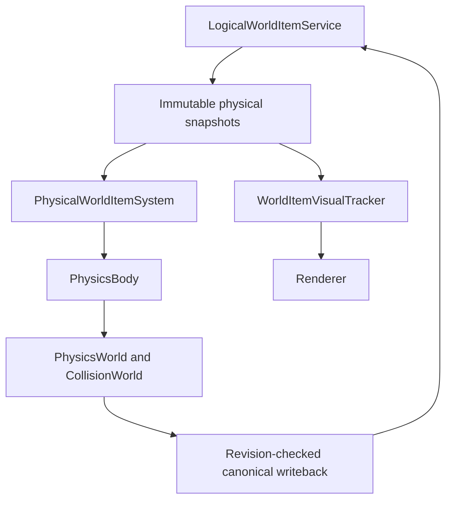

# Physical World Items Architecture

**Status:** Gates 11.1 through 11.5 implemented; automated verification pending final pass

**Baseline:** `origin/main@819a690f85ab4b1a192bd2db3bca73ddb573ced7`

**Detailed design:**
`docs/superpowers/specs/2026-08-04-phase-11-physical-world-items-design.md`

## Authority boundary

`LogicalWorldItemService` is the sole world-item domain store. It owns stable
IDs, canonical stacks, pickup timing, reservations, lifecycle, canonical
position/velocity, physical state, and revision.

`PhysicalWorldItemSystem` is a game-composition projection over existing engine
physics. Its stable-ID map contains one `PhysicsBody` and bounded transient
projection data per projected item. It does not contain another stack, material
identity, or lifecycle authority. The projection owns fixed-step physical
policy while the logical service remains authoritative.

Renderer consumes immutable presentation snapshots only. It does not call the
world-item, inventory, physics, mutation, or targeting services.



## Runtime extension

Existing Phase 7 signatures stay unchanged. A narrow engine-owned
`WorldItemRuntimeAccess` exposes stable-ID-ordered immutable physical snapshots
and expected-revision motion updates. The logical service implements it.

Motion results are closed:

- `APPLIED`
- `STALE_REVISION`
- `UNKNOWN_ITEM`
- `INVALID_MOTION`
- `REVISION_EXHAUSTED`

Applied updates increment the same revision used by stack extraction. Stale or
invalid updates do not mutate canonical state and are not retried blindly.
Revision exhaustion is likewise closed and idempotent: it preserves canonical
motion, count, reservation terminal state, and any active extraction lock.
Partial extraction exhaustion carries the present reservation, current
`Long.MAX_VALUE` item snapshot, and the exact positive canonical remainder;
missing or inconsistent remainder payloads are invalid. Full extraction at
`Long.MAX_VALUE` remains the terminal removal path and creates no remainder.

Gate 11.1 established `PhysicalWorldItemSystem` as the game-owned projection
cache. Gate 11.2 extends that same cache with a fixed `1/60` step, gravity,
terminal-speed clamping, static voxel sweep/depenetration, restitution,
friction, support probing, deterministic sleep/wake, finite-world recovery,
and unloaded-Chunk freezing/reload. Production composition owns one system in
`GameContext` and runs `prepareStep`, `PhysicsWorld.step`, and `finishStep` once
per `FixedStepClock` update in `GameLoop`; render frames with no fixed update do
not advance items. The system can also run the same complete transaction
through `step(long)`. Its presentation snapshots carry the canonical immutable
runtime view plus previous/current coordinates and never store an alternate
`ItemStack` or world-item lifecycle.

`presentationSnapshots()` is the single interpolation boundary: it returns
uninterpolated immutable previous/current coordinates and accepts no alpha.
Render presentation code supplies alpha once to the snapshot coordinate
accessors; the projection never pre-interpolates coordinates.

Reconciliation sorts and de-duplicates identical source snapshots by stable ID.
Existing registered bodies are retained. Every item requiring a new body,
including new, previously skipped, missing, stale-replacement, and externally
lost projections, enters one ascending stable-ID admission sequence up to the
configured cap. Capacity-limited IDs are returned in the immutable metrics
snapshot and are retried when a slot becomes available. A previously mapped
body that is no longer registered by identity is marked lost without touching
logical state; it receives no priority over a lower eligible stable ID.
Non-motion runtime metadata (for example extraction reservation state) is
refreshed in place without replacing the body.
Synchronizing a retained body to a newer canonical revision also preserves
body identity and does not count as a rebuild; `rebuilt` is reserved for an
externally lost stable ID that is successfully admitted again.

Admission construction is transactional. A failed batch unregisters every
body created by that batch and publishes neither lost nor rebuilt
classification metrics. The internal lost classification remains eligible for
the next deterministic reconciliation, which publishes `lost` exactly once
and `rebuilt` only when that stable ID is actually admitted.

## Lifecycle

Canonical world-item automatic expiry is deferred. Phase 11 defines physical projection, pickup, unloaded-Chunk freezing and runtime cleanup, but does not define despawn duration or timeout-based stable-ID termination.

Sleeping duration, unloaded-Chunk duration, failed bounded world recovery, and
shutdown never delete a canonical item or alter its stack count. Phase 11 adds
no despawn timer, lifetime-countdown component, expiry transaction, expiry
event, or timeout terminal state. A canonical stable ID becomes terminal only
through an approved domain operation such as successful full pickup.

Live logical states are `ACTIVE`, `GROUNDED`, `SLEEPING`, and
`FROZEN_UNLOADED`. `TERMINAL` is observed when the logical snapshot disappears
after final extraction.

- `ACTIVE` integrates gravity and collision.
- `GROUNDED` has a valid downward support contact.
- `SLEEPING` remains still until a deterministic wake condition.
- `FROZEN_UNLOADED` retains logical state but has no PhysicsBody.
- `TERMINAL` removes the projection and stable-ID cache entry.

Chunk unload writes `FROZEN_UNLOADED`, removes the body, and preserves canonical
position and velocity. Availability is conservative: every Chunk touched by
the current collider and its next-step swept bounds must be loaded before the
body may integrate. Items created directly in unavailable data are frozen
without creating a body. If revision exhaustion prevents the frozen state from
being written, the body is still removed so unavailable collision data is
never traversed; reload reconstructs one body with the same stable ID.
Projection deletion never deletes a logical item.

## Physical contract

- Fixed update: `1/60 s`
- Cube edge: `0.50 block`
- Collider: centered `0.50` cube
- Gravity: `-25 blocks/s^2`
- Maximum fall speed: `-30 blocks/s`
- Restitution: `0.12`
- Horizontal friction: `0.25`
- Ground probe/snap: `0.02 block`
- Sleep threshold: `0.05 blocks/s` for 30 stable steps
- Pickup reach: `3.5 blocks`

Physics reuses static voxel sweep-and-slide and depenetration. It adds no
body-to-body collision, rotation, joints, stack solving, or moving voxel body.
Terminal velocity is clamped after gravity and impulses and before displacement.
Restitution applies on voxel contact; configured horizontal friction applies
only while a positive-Y support contact exists, never on a wall or ceiling.
Sleep requires 30 consecutive supported low-motion steps, and any unstable
step deterministically resets that count.

Initial-overlap recovery searches only finite representable in-world positions.
If no non-overlapping position exists below the configured world top, the
projection is discarded while canonical logical state remains unchanged; no
out-of-bounds or still-overlapping fallback body is registered. The projection
records the blocked stable ID, canonical revision, and intersecting Chunk
revisions as diagnostic invalidation data. It does not construct another body
while those values are unchanged. A canonical or relevant Chunk revision change
permits one deterministic recovery retry, and successful recovery clears the
diagnostic. `WorldItemPhysicsMetrics` exposes cumulative recovery failures and
the current blocked stable IDs. Physics or collision-query failure discards the
affected physical scratch transaction, publishes no staged lifecycle metrics,
and performs no canonical motion writeback. Invalid non-finite motion is
rejected before canonical writeback.

## Drop identity and presentation

Survival block drops use the destroyed block's real item form and a canonical
count-one `ItemStack`. Creative, air, unbreakable blocks, and blocks without an
item form do not create a drop. Q and block breaking share the existing unique
spawn-reservation authority. A successful Survival break always commits its
count-one result to that authority, even when player inventory has space; it
does not insert the broken block directly into inventory.

A plain Q press extracts exactly one item from the active slot. Left Ctrl+Q or
right Ctrl+Q extracts the complete active-slot stack. Each edge creates exactly
one canonical spawn reservation and commits the spawn before committing the
matching inventory extraction; any pre-commit spawn failure rolls back without
inventory loss. Held Q and held-only catch-up snapshots cannot replay the edge.
Q spawns `0.40 block` forward from the copied eye transform with `4.5 blocks/s`
forward velocity, `+1.25 blocks/s` vertical velocity, and deterministic lateral
variation bounded by `0.15 blocks/s`.

Spawn commits use the same applied-state discipline as extraction commits.
`WorldItemSpawnCommitException` identifies the exact spawn reservation and
states whether its canonical mutation applied. `WorldItemSpawnReservationAudit`
then exposes that same reservation and its `PENDING`, `COMMITTED`, or
`ROLLED_BACK` state. Blind independent retry or allocation of a replacement
stable ID is forbidden. Audited completion of the SAME reservation with the
SAME stable ID is allowed and required when the reservation is proven PENDING
and the commit barrier must be completed. Barriers never retry an already
applied mutation or roll back a committed spawn. An unclassifiable
provider outcome retains the reservation identity, blocks another operation,
and is resolved during owner shutdown rather than reported as a normal
non-applied result.

Block drops spawn at the destroyed block center. Their horizontal direction is
away from the copied player position. The deterministic base/outward horizontal
magnitude is `1.25..1.75 blocks/s`. A separately hashed orthogonal lateral
component is bounded by `+/-0.20 blocks/s`; it does not alter the outward range,
and the total horizontal resultant is at most
`sqrt(1.75^2 + 0.20^2)`, approximately `1.7614 blocks/s`. Vertical velocity is
`+1.40 blocks/s`. Degenerate player/block alignment uses a stable event hash
rather than global random state.

Block items render as a six-face `0.50` cube. Face regions are resolved through
the existing `BlockRegistry` and immutable material definitions. Unknown items
use an explicit missing cube. The stable-ID visual tracker remains a
presentation cache, not a store.

## Input contract

Q and Ctrl+Q use the same lifecycle gate as world interaction. Either Ctrl key
must be down on the Q press edge to request the complete stack; Ctrl state on a
later held-only step cannot change or replay that request.

Pickup uses Shift+right press edge in Survival and outside noclip. It never uses
held input. Lifecycle suppression and release/re-arm remain owned by
`InputManager`.

Priority is:

1. lifecycle and blocking state;
2. F4 mode transition;
3. Shift+right pickup;
4. ordinary right placement;
5. existing left break behavior.

The pure `WorldInteractionInputRouter` removes the right edge from the derived
block input after a pickup chord claims it. Pickup failure does not place a
block. Catch-up `heldOnly()` steps cannot repeat pickup.

Targeting uses the authoritative player eye and Camera direction, intersects
immutable physical-item AABBs, applies a 3.5-block reach and independent block
occlusion distance, then chooses nearest distance and stable-ID order. Renderer
does not target items.

Pickup remains manual-only. Walking near a world item never mutates inventory,
never attracts the item, and never starts a transaction. Only Survival
Shift+right-click (either Shift key) performs the independent item ray/AABB
targeting and pickup operation. Ordinary right-click remains placement and the
router makes the two chords mutually exclusive.

## Pickup transaction

Pickup first reserves all inventory capacity available for the canonical stack,
then reserves the exact accepted count from the same stable world item. A
failure before the commit barrier reverse-rolls back every acquired reservation.

Inside the barrier, inventory reservations commit before the world extraction.
Applied notification failures are recorded but cannot roll back or stop the
other guaranteed commit. Full extraction makes the stable ID terminal; partial
extraction keeps the same stable ID and increments revision.

The invariant is:

```text
original world-item count
= inventory committed count + remaining world-item count
```

Applied-state exceptions are never retried or compensated. Untyped
indeterminate outcomes trigger read-only reservation diagnosis and fatal
shutdown if still unresolved.

## Fixed-step order

1. Consume and route input.
2. Inventory selection.
3. Player fixed update.
4. Reconcile item projections.
5. PhysicsWorld step.
6. Canonical motion writeback.
7. Lifecycle-gated Q transaction, pickup targeting, and block interaction.
8. Committed gameplay feedback and particles.
9. Remaining modules and events.

## Particle and performance policy

The existing 512-particle hard cap remains. LOW particles are capped at 384;
128 capacity is reserved for committed HIGH effects. LOW cannot evict HIGH.
HIGH evicts the oldest LOW first. Requests are capped at 64 per fixed step and
32 particles per request.

Committed break emits exactly 16 HIGH block-debris particles and 4 subtle HIGH
astral sparks. Committed placement emits exactly 6 HIGH debris particles and 2
HIGH astral sparks. A committed full or partial pickup emits exactly 8 HIGH
inward particles. Failed, delayed, cancelled, or repeated actions emit no
committed particles.

Break debris uses a deterministic golden-angle azimuth rotated by the immutable
event hash and a stratified vertical component across approximately
`-0.65..+0.85`. Speed is `1.8..2.6 blocks/s`, gravity is `-12 blocks/s^2`, drag
is light, size is `0.045..0.085 block`, lifetime is `0.28..0.52 seconds`, and
size shrinks to zero. The normal 16-particle request covers all horizontal
quadrants and includes downward initial motion. Placement particles spread
primarily tangent/outward from the contact face. Pickup particles start around
and converge toward the committed item position. Face regions are selected
deterministically across the six canonical faces.

## Committed gameplay presentation

`InteractionFeedbackCoordinator` is the one game-owned committed-feedback
boundary. Gameplay transactions decide and commit state first; immutable
receipts then register render-only animation, camera impulse, transient block
presentation, and bounded particle requests. Feedback never retries or rolls
back inventory, world-item, or voxel mutations.

The minimal first-person six-face held item has deterministic `PLACE` (0.14 s),
`BREAK_SWING` (0.19 s), and `DROP` (0.12 s) transforms. A newer committed action
restarts at time zero; every state returns exactly to identity. Focus loss, F1,
blocking UI, and shutdown clear it immediately.

Camera feedback uses a deterministic bounded analytic/cubic render-view
envelope. Pitch and yaw are clamped to +/-1 degree and translation to +/-0.025
block. The renderer derives
a copied visual view while frustum culling, targeting, `Camera.forward()`, and
saved orientation use the canonical view unchanged.

The Phase 12 release candidate uses `+0.275` degree pitch and deterministic
`+/-0.07` degree yaw for committed break feedback, exactly half the original
Phase 11.6 amplitudes. A rapid break restarts the 0.20-second break envelope;
it does not add to an unfinished break impulse. Placement feedback and the
independent held-item break swing retain their existing behavior.

Committed placement mutates World/collision immediately, then shows a 0.14 s
render-only scale transition from 0.85 to 1.00. Committed break removes
World/collision immediately and preserves the old six-face appearance in a
0.18 s shrinking/fading non-colliding proxy. A bounded 256-cell presentation
map keeps at most one transition per coordinate, replaces same-coordinate and
oldest entries deterministically, and supplies an immutable fragment exclusion
mask so stale or normal chunk geometry cannot obscure the proxy. Expiration or
shutdown removes both proxy and mask without touching Chunk revision.

Allocation and GC evidence must be collected before pooling. Pooling is not
enabled by default and can never include canonical stacks, stable IDs,
reservations, or public immutable snapshots.

The approved full fixture (1,024 logical items, 512 particle cap, 600 warm-up
steps, and 3,600 sampled steps) measured 3,679,206,752 allocated bytes over the
60-second sample (about 58.5 MiB/s), 12 GC collections, 27 ms aggregate GC
time, and a 3 ms maximum observed pause. Allocation rate and collection count
exceed the review thresholds. Phase 11 therefore records a follow-up need for
allocation attribution between existing physics, immutable snapshot capture,
projection work, and particle advancement. It does not enable pooling without
that attribution; any future internal reuse remains bounded and may not pool
canonical or public immutable values.

## Chunk unload and shutdown

Missing Chunk collision data causes freeze, never air assumptions. Frozen items
retain logical capacity and have no body. Shutdown stops new actions, finishes
an entered synchronous commit barrier, rolls back only pre-barrier runtime
reservations, unregisters all bodies, clears stable-ID presentation and particle
caches, then closes renderer and engine resources in existing reverse order.
Shutdown is idempotent and never removes a canonical item merely because the
process is closing.

All GL creation, update, draw, and destruction remain on the OpenGL context
owner thread. OpenGL 4.1 and GLSL 410 remain the maximum platform contract.

## Protected interfaces

- canonical `ResourceLocation` and `ItemStack`;
- Phase 7 inventory and world-item reservation signatures;
- `BodyInventoryService` as the inventory mutation boundary;
- `LogicalWorldItemService` as the only world-item store;
- Phase 6 fixed-step and voxel-collision ownership;
- Phase 9A mutation, drop conservation, and input semantics;
- Phase 9B committed-only feedback and stable-ID visuals;
- Phase 10 immutable UI/render presentation;
- main-thread OpenGL ownership.
