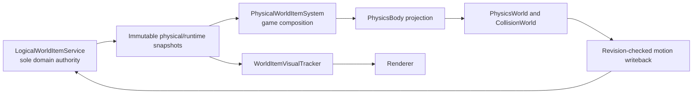
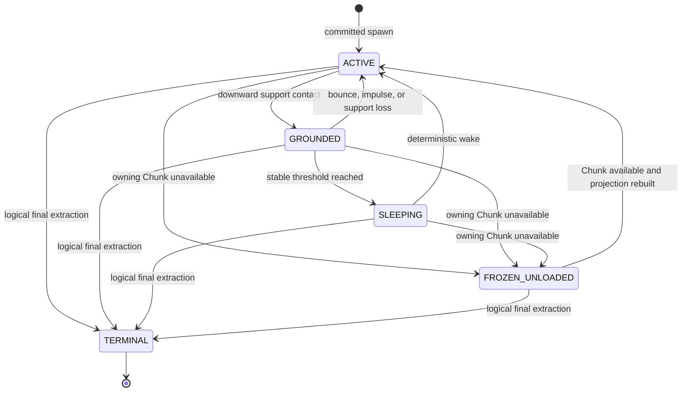

# Phase 11 Physical World Items Design

**Date:** 2026-08-04

**Status:** Approved design; production implementation has not started

**Branch:** `feat/physical-world-items`

**Baseline:** `origin/main@819a690f85ab4b1a192bd2db3bca73ddb573ced7`

**Scope:** physical world-item projections, manual pickup, complete block-item visuals,
and bounded particle/runtime metrics

## 1. Purpose and non-goals

Phase 11 turns the existing logical world-item service into the sole authority
behind physically simulated dropped items. It adds a main-thread projection into
the Phase 6 physics world, a Shift+right-click pickup transaction, and a bounded
particle-capacity policy. It does not create a second item entity model.

The phase does not implement:

- automatic proximity pickup;
- dynamic body-to-body collision;
- rotation, angular integration, joints, or stack solving;
- moving voxel structures;
- persistence or infinite-world streaming;
- renderer-owned targeting or gameplay mutation;
- pooling of `ItemStack`, stable IDs, or public immutable snapshots;
- OpenGL 4.2+, compute shaders, SSBOs, or worker-thread GPU work.

## 2. Baseline findings

The Phase 11 branch began clean and at `0/0` divergence from `origin/main`.
Phase 10 is present at the baseline commit. No local or remote
`feat/astral-environment-ambience` branch was found during the design audit.

The current implementation already provides:

- one canonical `ItemStack(ResourceLocation, positive count)`;
- one `LogicalWorldItemService` with stable IDs, spawn/extraction reservations,
  pickup delay, position, velocity, revision, and immutable snapshots;
- `PhysicsBody`, `PhysicsWorld`, `CollisionWorld`, swept voxel collision, and
  depenetration;
- fixed 1/60 input/update ownership with press edges visible only in the first
  catch-up step;
- a stable-ID `WorldItemVisualTracker` that is a reconstructable presentation
  cache rather than a domain store;
- a CPU `ParticleSystem` with an existing 512-particle cap;
- immutable renderer inputs and main-context-thread GPU ownership.

The main gap is that `LogicalWorldItemService` has no runtime-list or canonical
motion-update contract. The current particle overflow policy is global
oldest-first, so low-priority particles can evict committed interaction effects.

## 3. Authority model



`LogicalWorldItemService` remains authoritative for:

- stable `WorldItemId`;
- canonical `ItemStack`;
- spawn and extraction reservations;
- pickup delay and logical lifecycle;
- canonical position and velocity;
- canonical physical state and revision.

`PhysicalWorldItemSystem` stores only:

- stable ID to one `PhysicsBody` projection;
- a bounded sleep-stability counter;
- current-step ground/contact scratch state.

It must not store another `ItemStack`, item definition, material identity, or
independent lifecycle. A projection position is integration scratch only. A
successful revision-checked writeback makes the returned logical snapshot the
next fixed step's baseline.

`WorldItemVisualTracker` remains a rebuildable stable-ID presentation cache.
Deleting a visual or physical projection never removes a logical item.

## 4. Runtime contract extension

Existing Phase 7 interfaces and record signatures remain intact. Phase 11 adds
narrow engine-owned contracts beside them:

- `WorldItemPhysicalState`: `ACTIVE`, `GROUNDED`, `SLEEPING`,
  `FROZEN_UNLOADED`;
- `WorldItemPhysicalSnapshot`: wraps the existing
  `WorldItemRuntimeSnapshot`, current physical state, and a read-only
  extraction-reserved flag;
- `WorldItemMotionUpdate`: stable ID, expected revision, finite position,
  finite velocity, and requested physical state;
- `WorldItemMotionUpdateResult`: `APPLIED`, `STALE_REVISION`, `UNKNOWN_ITEM`,
  `INVALID_MOTION`, or `REVISION_EXHAUSTED`, plus the authoritative snapshot
  when available;
- `WorldItemRuntimeAccess`: stable-ID-ordered immutable runtime snapshots and
  atomic motion updates.

`WorldItemMotionUpdateResult` validates its status/payload shape at
construction, so `UNKNOWN_ITEM` is the only status without an authoritative
snapshot and every other status carries one. Gate 11.1 reconciliation
de-duplicates identical source snapshots, retains valid projections, admits
new IDs in deterministic stable-ID order up to capacity, and reports skipped
IDs without throwing. A body missing from `PhysicsWorld` by object identity is
treated as a lost projection and rebuilt for the same stable ID. Runtime
metadata such as extraction reservation state refreshes independently from
motion and does not rebuild an unchanged body.

`presentationSnapshots()` returns uninterpolated immutable previous/current
coordinates without an alpha argument. Render presentation performs the one
interpolation step through the coordinate accessors.

`LogicalWorldItemService` implements `WorldItemRuntimeAccess`. An applied motion
update increments the same revision used by stack extraction. A stale update is
never retried automatically and never overwrites the current logical state.
Revision advancement is centralized. `Long.MAX_VALUE` produces a closed,
idempotent exhaustion result before motion mutation, extraction terminalization,
or active-lock release.

`TERMINAL` is an observed projection transition, not a live snapshot value.
The authoritative terminal fact is absence after the logical extraction commit
removes the final count. The projection observes that absence, transitions to
`TERMINAL`, unregisters its body, and removes its map entry in the same
reconciliation step.

Read-only reservation-audit interfaces may be added for exceptional diagnosis.
They expose terminal state and reserved counts without committing, rolling back,
or becoming a normal transaction control path. They do not replace
`InventoryService` or `WorldItemService`.

## 5. Stable-ID projection rules

Each fixed step performs the following sequence:

1. Read an immutable, stable-ID-ordered physical snapshot list.
2. Remove projections whose logical snapshots no longer exist.
3. Freeze projections whose owning Chunk is unavailable.
4. Rebuild missing projections for loaded, non-terminal snapshots.
5. Apply deterministic wake, velocity clamp, and recovery checks.
6. Run the existing 1/60 `PhysicsWorld` step.
7. Probe support, apply bounded ground snap, and update sleep counters.
8. Write position, velocity, and state through expected-revision CAS.
9. Adopt the returned authoritative snapshot after `APPLIED`.
10. Discard the projection after `STALE_REVISION`; reconstruct from the newest
    logical snapshot on the next reconciliation pass.

Projection creation, registration, movement, writeback, removal, and shutdown
all run on the main fixed-update thread. No worker receives a mutable
`PhysicsBody` or a mutable world-item collection.

### 5.1 Chunk unload and reload

The approved unload policy is:

- retain the logical item and its last canonical position and velocity;
- atomically write `FROZEN_UNLOADED` before dropping the body;
- remove and discard the `PhysicsBody` projection;
- do not integrate gravity and do not expose the item to pickup targeting while
  frozen;
- when the owning Chunk becomes available, transition through a
  revision-checked update and rebuild one body with the same stable ID;
- preserve the canonical velocity across the frozen interval;
- allow logical terminal removal to end the stable ID while frozen.

Projection loss caused by an exception follows the same rebuild path but does
not change the logical lifecycle by itself.

## 6. Physical state machine



Deterministic wake sources are a committed spawn, an externally changed
canonical revision, an explicit impulse, support loss, and Chunk reload. A
sleeping item is not integrated until a wake condition occurs.

## 7. Physical constants and recovery

| Property | Production value |
|---|---:|
| Fixed step | `1/60 s` |
| Cube visual/collider edge | `0.50 block` |
| Local collider | centered `[-0.25, +0.25]` on all axes |
| Gravity | existing `-25 blocks/s^2` |
| Maximum fall speed | `-30 blocks/s` |
| Restitution | `0.12` |
| Horizontal friction | `0.25` |
| Ground probe/snap | `0.02 block` |
| Sleep linear-speed threshold | `0.05 blocks/s` |
| Sleep stable steps | `30` (`0.5 s`) |
| Depenetration attempts | existing maximum `8` |
| Pickup reach | `3.5 blocks` |

The `1.00 block` cube remains an artificial visual/collision comparison fixture
only. Runtime item-specific scaling is not permitted in Phase 11.

Before every logical writeback, all position and velocity components must be
finite. Invalid motion is rejected without updating the canonical snapshot and
the projection is discarded.

Spawn overlap recovery first uses `CollisionWorld.depenetrate`. If it cannot
recover within eight iterations, the system scans upward in deterministic
`0.25` increments within the loaded column and uses the first non-overlapping
position. The world-top safe layer is the final recovery location. Falling
below the finite world's lower bound uses the same bottom-to-top safe-column
search. An unavailable X/Z Chunk freezes the item instead of guessing collision
data or deleting it.

Phase 11 does not add dynamic body collision, rotation, angular velocity,
joints, continuous stack solving, or moving voxel structures.

## 8. Complete block-drop rules and visuals

Survival block breaking already derives a canonical count-one `ItemStack` from
the destroyed block's real `ItemFormDefinition`. Phase 11 preserves and locks
that rule:

- a normal block with an item form produces one canonical block item;
- air, blocks without item forms, and unbreakable blocks produce no invented
  drop;
- Creative breaking produces no drop;
- Q dropping and block breaking use the same `WorldItemService` spawn path;
- no `BlockDropEntity`, `BlockStack`, alternate ID registry, or ECS item store is
  introduced.

The production visual is a full six-face textured cube with edge `0.50`.
Game-owned resolution maps the canonical item ID back through the existing
`BlockRegistry` and immutable block/material definitions. It sends a six-face
immutable visual description to the existing stable-ID tracker. Unknown or
non-block items use an explicit missing cube. The shared block atlas identity
is not changed.

Renderer input remains immutable. Renderer code does not call
`WorldItemService`, `PhysicsWorld`, `InventoryService`, or gameplay targeting.
Active projections may expose an immutable previous/current presentation pair
for interpolation. Sleeping and frozen items use current=current. Presentation
interpolation is reconstructable and is not canonical motion storage.

## 9. Input routing and targeting

Pickup is `Shift + right mouse press edge` in Survival only. Either physical
Shift key is accepted. Noclip and Creative suppress pickup. Ordinary right
mouse remains placement.

### 9.1 Input priority

| Priority | Condition | Result |
|---:|---|---|
| 1 | loading, blocking UI, F1 release, or focus loss | no destructive action |
| 2 | F4 press edge | cancel pickup/break/place for this step; switch mode through the existing owner |
| 3 | Survival, not noclip, Shift+right press edge | claim pickup; suppress placement edge |
| 4 | ordinary right press edge | existing block placement |
| 5 | left input | existing Survival held break or Creative press break |

`WorldInteractionInputRouter` is a pure per-step transformation. It owns no
button state and creates no second input authority. Once it recognizes a pickup
chord, it removes only the secondary-button edge from the derived block input.
Failure to find or pick up an item does not fall through to placement.

The existing `InputManager` remains responsible for physical press/release,
focus suppression, cursor-capture suppression, and re-arm. The existing
catch-up policy supplies the full snapshot only to the first fixed step and
`heldOnly()` snapshots thereafter, so a physical press can start at most one
pickup transaction.

### 9.2 World-item targeting

The targeting boundary uses:

- origin: authoritative player feet from `PhysicsBody` plus eye height;
- direction: Camera forward;
- candidates: immutable physical-item AABBs in `ACTIVE`, `GROUNDED`, or
  `SLEEPING` state;
- reach: configurable production default `3.5 blocks`;
- intersection: deterministic slab ray/AABB intersection;
- ordering: nearest non-negative distance, then stable ID ascending;
- occlusion: a separate invocation of the Phase 6 block raycast limits the
  visible distance, without reusing or mutating the block interaction hit.

Items whose pickup delay has not expired, items with an active extraction
reservation, frozen items, and terminal IDs are excluded. Targeting runs in the
game fixed-update path and never in Renderer.

## 10. Pickup reservation plan

`WorldItemPickupTransaction` depends on the canonical inventory and world-item
interfaces. It reads no UI state and owns no stored item collection.

Normal execution is:

1. Re-read the target stable ID's runtime snapshot.
2. Validate existence, physical eligibility, and pickup delay.
3. Reserve inventory insertion in deterministic order: active body slot first,
   followed by remaining `BodySlot` values without duplicates.
4. Sum the exact accepted count across acquired inventory reservations.
5. If the accepted count is zero, reverse-roll back acquired reservations and
   report full inventory.
6. Reserve exactly the accepted count from the same stable world item.
7. If world reservation fails, reverse-roll back all inventory reservations.
8. Enter a synchronous, non-cancellable commit barrier.
9. Commit every inventory reservation exactly once.
10. Continue after an applied post-commit notification failure.
11. Commit the world extraction reservation exactly once.
12. Verify original world count equals inventory committed count plus the
    remaining canonical world count.

Partial inventory capacity is valid. It leaves the remainder under the same
stable ID with an incremented revision. Full extraction makes the logical item
absent and therefore terminal.

## 11. Pickup transaction table

| Scenario | Inventory action | World-item action | Required result |
|---|---|---|---|
| Complete capacity | reserve all, commit | reserve all, commit terminal | `PICKED_ALL` |
| Partial capacity | reserve accepted, commit | reserve accepted, commit remainder | `PICKED_PARTIAL` |
| Full inventory | no effective reservation | no world reserve | `INVENTORY_FULL` |
| Pickup delay active | no call | no reservation | `PICKUP_DELAYED` |
| Stable ID absent | no call | no reservation | `UNKNOWN_ITEM` |
| Active world reservation | reverse rollback inventory | `UNAVAILABLE` | `WORLD_ITEM_BUSY` |
| Inventory reservation failure | reverse rollback acquired entries | no world reserve | `INVENTORY_REJECTED` |
| World reservation failure | reverse rollback all inventory | no mutation | `WORLD_REJECTED` |
| Inventory notification failure | count as applied | continue guaranteed world commit | `PICKED_WITH_NOTIFICATION_FAILURE` |
| World applied-state failure | retain applied fact | no retry or rollback | aggregated diagnostic |
| Fresh world commit is not committed | inventory may be applied | guarantee breach | fatal invariant failure |
| Duplicate physical press | no second transaction | no call | no side effect |
| Duplicate commit call | `ALREADY_COMMITTED` | `ALREADY_COMMITTED` | no duplicate count |
| Rollback before commit | unlock | unlock | original counts |
| Commit after rollback | terminal conflict | terminal conflict | original counts |
| Fatal Error in committed notification | applied | finish all guaranteed commits, then rethrow original Error | conserved counts then shutdown |
| Shutdown before barrier | reverse rollback | rollback | safe stop |
| Shutdown inside barrier | finish barrier | finish barrier | stop after conservation |

The governing invariant is:

```text
original world-item count
= inventory committed count + remaining world-item count
```

## 12. Commit and failure semantics

Current `BodyInventoryService` converts post-commit `RuntimeException` and
`Error` failures into `InventoryEventDispatchException` with
`stateChangeApplied=true`. Phase 11 preserves this behavior.

World-item commits adopt the same explicit applied-state rule through a typed
runtime failure carrying reservation ID and `stateChangeApplied`:

- failures before application report `false`;
- failures after application report `true`;
- an applied failure is counted, never rolled back, and never blindly retried;
- the other guaranteed commit must still run;
- recoverable notification failures are aggregated;
- an original fatal `Error` is rethrown only after the conservation barrier.

An untyped exception after a commit call is an indeterminate provider-contract
violation. The coordinator does not call commit again. It uses read-only
reservation audit state for diagnosis. If the outcome remains unknown, it
records the stable ID, both reservation IDs, and pre-transaction counts, then
requests fatal shutdown. Built-in-service tests must prove that normal
implementation paths never expose an unclassified post-application failure.

Rollback runs in reverse acquisition order. A rollback failure is attached as a
suppressed diagnostic and never overwrites the primary failure. Rollback is
never used to compensate an already applied commit.

## 13. Fixed-step composition order

The game loop order becomes:

1. consume one `InputSnapshot` and derive inventory, pickup, and block routes;
2. process slot selection, wheel, Q, and inventory debug input;
3. update the player fixed-step state;
4. reconcile physical world items before physics;
5. run `PhysicsWorld.step(1/60)`;
6. write physical item motion back to the logical service;
7. run Shift+right pickup targeting and transaction;
8. run the existing block break/place controller with routed input;
9. advance interaction feedback and particles;
10. run remaining modules and event processing.

A Q-spawned item can join physics in the current step. A block drop committed
after the physics step receives its projection at the beginning of the next
fixed step. Pickup targets the latest canonical motion written during the
current step.

## 14. Particle capacity and priority

The total active-particle cap remains 512.

| Capacity | Limit | Policy |
|---|---:|---|
| Low-priority active particles | `384` | reject new LOW at cap |
| High-priority reserve | `128` | protected from LOW |
| Total active particles | `512` | hard cap |
| Emission requests per fixed step | `64` | deterministic rejection after cap |
| Particles per emission request | `32` | hard validation cap |

Ambient and continuous-break particles are LOW. Committed break and committed
pickup particles are HIGH. At total capacity, HIGH evicts the oldest LOW first
and only then the oldest HIGH. LOW never evicts HIGH. Existing committed break
bursts remain 24 particles. A committed pickup may emit at most six small HIGH
particles. Delay, targeting failure, reservation failure, cancellation, and a
duplicate press emit none. Phase 11 adds no landing-particle stream.

The future ambience branch must rebase onto this priority/cap API and add LOW
categories to the same `ParticleSystem`. It must not create a parallel queue,
pool, renderer, or incompatible `ParticleEmission` model. A compatibility
constructor maps current categories during migration.

## 15. Measurement before pooling

Read-only `ParticleAllocationMetrics` and `WorldItemPhysicsMetrics` report:

- received, admitted, and rejected emission requests;
- particle states created and advanced;
- active, grounded, sleeping, and frozen projection counts;
- bodies created, rebuilt, and destroyed;
- motion writes and stale rejections;
- fixed-step allocation estimates.

The deterministic profiling fixture uses a flat world, a fixed seed, up to
1,024 logical items, up to 1,024 loaded bodies, and 512 active particles. It
warms for 10 seconds and samples for 60 seconds. On JDK 21 it records current
thread allocated bytes plus GC collection count and pause evidence when the VM
exposes those counters.

Pooling is not enabled by default. A later bounded internal reuse proposal is
allowed only if the fixture attributes one of these conditions to Phase 11:

- sustained allocation above `2 MiB/s`;
- more than two GC collections per minute;
- a maximum GC pause above `5 ms`.

Canonical `ItemStack`, stable IDs, public immutable snapshots, and reservation
values are never pooled.

## 16. Caps and finite-world behavior

The existing world-item hard cap remains 1,024 logical live items, including
pending committed-spawn capacity according to the existing reservation rules.
Loaded physical projections cannot exceed live logical items. Frozen items
consume logical capacity but no `PhysicsBody`.

World bounds are resolved from loaded Chunk ownership and the existing finite
vertical world range. The physics system never queries missing Chunk voxel data
as though it were air. It freezes at missing X/Z ownership and uses deterministic
safe-column recovery at vertical bounds.

## 17. Shutdown and exception ownership

Shutdown order is:

1. stop accepting new pickup and spawn commands;
2. finish any synchronous transaction already inside the commit barrier;
3. reverse-roll back reservations that have not entered the barrier;
4. unregister every world-item body from `PhysicsWorld`;
5. clear projections and immutable presentation caches;
6. clear particle state;
7. close existing renderer GPU resources on the GL owner thread;
8. close worker executors;
9. close engine, window, and context.

All close operations are idempotent. Partial initialization performs the same
operations in reverse construction order. Projection cleanup never deletes a
logical item. An exception before motion writeback leaves the logical snapshot
authoritative and causes the projection to be rebuilt.

## 18. Platform and rendering compatibility

- Java source and target remain 17; JDK 21 may run the build and profiling.
- All OpenGL work remains on the main context thread.
- OpenGL remains 4.1 and GLSL remains 410.
- No compute shader, SSBO, or platform-specific graphics API is introduced.
- Renderer consumes immutable presentation batches only.
- Retina/content-scale behavior remains owned by the existing rendering and UI
  surface contracts; world-item physics uses world units and is DPI-independent.
- Windows and macOS use identical fixed-step constants and deterministic seeds.

## 19. Implementation gates and ownership

### Gate 11.1 - Runtime authority contracts

**Owner:** Engine developer; game developer reviews public integration.

Expected scope:

- `engine/.../worlditem/api/WorldItemPhysicalState.java`
- `engine/.../worlditem/api/WorldItemPhysicalSnapshot.java`
- `engine/.../worlditem/api/WorldItemMotionUpdate.java`
- `engine/.../worlditem/api/WorldItemMotionUpdateResult.java`
- `engine/.../worlditem/api/WorldItemRuntimeAccess.java`
- `engine/.../worlditem/LogicalWorldItemService.java`
- focused engine tests

### Gate 11.2 - Physical projection

**Owner:** Game developer; engine developer reviews Physics/Collision use.

Expected scope:

- `game/.../worlditem/PhysicalWorldItemSystem.java`
- internal stable-ID projection and immutable metrics values
- game-level configuration adapter
- projection, collision, sleep, bounds, and unload tests

### Gate 11.3 - Input, targeting, and pickup transaction

**Owner:** Game developer.

Expected scope:

- `game/.../worlditem/WorldInteractionInputRouter.java`
- `game/.../worlditem/WorldItemTargetingService.java`
- `game/.../worlditem/WorldItemPickupTransaction.java`
- closed result types and reusable multi-slot reservation planner
- exact-order and count-conservation tests

### Gate 11.4 - Visuals, particles, and measurement

**Owner:** Engine renderer owner and game owner jointly.

Expected scope:

- immutable six-face visual contract and existing world-item pass migration;
- game-owned BlockRegistry visual resolver;
- priority-aware existing ParticleSystem and compatibility adapter;
- immutable allocation/runtime metric snapshots;
- headless profiling fixture and render-state tests.

### Gate 11.5 - Composition, verification, and handoff

**Owner:** Shared.

Expected scope:

- `GameBootstrap`, `GameContext`, and `GameLoop` composition only;
- shutdown registration in correct reverse order;
- optional read-only DebugHud counts;
- complete tests, resource checks, manual matrices, architecture updates, and
  Phase 11 handoff.

No gate may implement later-gate behavior before its preceding contracts and
tests are reviewed.

## 20. Test strategy

### Authority and runtime

- stable ID maps to exactly one live projection;
- runtime snapshot lists are immutable and stable-ID ordered;
- motion updates apply only at the expected revision;
- stale and invalid updates do not mutate canonical state;
- stack extraction and motion share one revision sequence;
- final extraction is the only terminal removal path;
- deleting/rebuilding projections preserves the logical item.

### Physics

- fixed 1/60 determinism across frame schedules;
- maximum fall speed and high-speed ground collision;
- wall, floor, corner, and cross-Chunk collision;
- restitution, horizontal friction, ground snap, and tolerance;
- sleep stable-step threshold and deterministic wake;
- Chunk unload freeze and reload reconstruction;
- spawn overlap depenetration and safe-layer fallback;
- lower-bound recovery;
- NaN/Infinity rejection;
- no body-body collision or second store.

### Input and targeting

- Shift+right press, hold, release, and re-press;
- multiple catch-up fixed steps execute at most one pickup;
- ordinary right press still places and never targets items;
- F1, focus loss, loading, blocking UI, and F4 cancel pickup;
- Creative and noclip reject pickup;
- ray/AABB nearest hit, stable-ID tie-break, occlusion, and reach boundary;
- pickup delay and active-reservation exclusion;
- Renderer has no targeting dependency.

### Transactions

- every row in the transaction table;
- exact ordered reservation/commit/rollback calls;
- full and partial count conservation;
- full inventory, delay, missing ID, and busy-item no-op paths;
- inventory notification RuntimeException and Error causes;
- world applied-state failure and guarantee breach;
- duplicate press, commit, and rollback;
- shutdown before and inside the barrier;
- no UI snapshot, alternate stack, or blind retry.

### Particles and visuals

- LOW cannot evict HIGH;
- HIGH evicts oldest LOW first;
- total, low, request, and per-request caps;
- deterministic overflow and fixed-step lifetime;
- committed pickup only emits once;
- six-face block material identity and missing fallback;
- stable-ID add/update/remove behavior;
- immutable render batches and complete GL state restoration;
- main-thread GPU lifetime and idempotent cleanup.

### Integration

- exact fixed-system ordering;
- Q spawn current-step projection and block drop next-step projection;
- renderer reads post-writeback immutable presentation;
- other fixed systems still run when pickup is disabled;
- Phase 8, 9A, 9B, and 10 behavior remains unchanged.

## 21. Verification plan

Windows automation:

```powershell
.\gradlew.bat :engine:test --console=plain --no-daemon
.\gradlew.bat :game:test --console=plain --no-daemon
.\gradlew.bat clean test build --console=plain --no-daemon
.\gradlew.bat :game:verifyPackagedResources --rerun-tasks --console=plain --no-daemon
.\gradlew.bat :engine:verifyPackagedShaderResources --rerun-tasks --console=plain --no-daemon
.\gradlew.bat :game:verifyInstalledShaderResources --rerun-tasks --console=plain --no-daemon
```

Manual Windows acceptance covers Q and block-drop parity, complete and partial
pickup, full inventory, pickup delay, Chunk edges, 0.50/1.00 comparison fixture,
F1, F4, focus loss, resize, Escape, and the profiling fixture.

macOS acceptance covers native JDK 21 build/launch, OpenGL 4.1/GLSL 410,
Retina, resize, focus, fixed-step behavior, item visuals, particles, and
shutdown. If unavailable, the handoff must state `NOT RUN`.

Repository checks include `git diff --check`, generated-file scans, absolute
JDK path scans, engine-to-game dependency scans, worker-thread GL scans,
duplicate ItemStack/store scans, and a final branch-wide owner review.

## 22. Protected interfaces

Phase 11 implementation must not break:

- canonical `ResourceLocation` and `ItemStack`;
- Phase 7 `InventoryService`, `InventoryReservation`, `WorldItemService`,
  `WorldItemReservation`, and spawn-reservation semantics;
- `BodyInventoryService` as the only inventory mutation owner;
- `LogicalWorldItemService` as the only world-item store;
- Phase 6 fixed-step and static voxel collision ownership;
- Phase 9A transaction, raycast, mutation, dirty, and event ordering;
- Phase 9B stable-ID presentation and committed-only feedback;
- Phase 10 immutable UI and renderer presentation boundaries;
- main-context-thread GPU ownership and GLSL 410 compatibility.

## 23. Design self-review checklist

- One world-item store and one canonical ItemStack are used.
- Shift+right never falls through to ordinary placement.
- Every commit failure class has an explicit policy.
- Chunk unload, reload, bounds, terminal removal, and shutdown are specified.
- Particle pooling is evidence-gated and disabled by default.
- Future ambience work has an explicit single-API integration order.
- Renderer remains immutable and read-only.
- No unresolved placeholder remains in this design.
